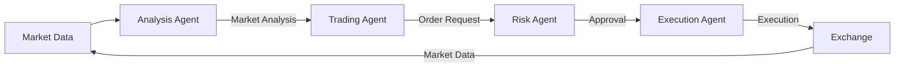

# Building an AI Team of Professional Traders for HyperLiquid

*How we built a multi-agent trading system that works like a professional prop desk*

## The Problem with Traditional AI Trading Bots

Most AI trading systems suffer from a critical flaw: they're monolithic thinkers. They attempt to process market data, assess risk, execute trades, and monitor performance all within a single, overwhelmed AI model. It's like asking one person to be simultaneously a market analyst, risk manager, execution specialist, and portfolio manager.

### Common Pitfalls:
- **Rushed Decisions**: Making trades without comprehensive analysis
- **Conflicting Objectives**: Struggling to balance risk and return
- **Lack of Specialization**: One-size-fits-all approach to different market conditions
- **Black Box Decisions**: Limited explainability behind trading actions

## The Solution: A Team of Specialized AI Agents

Instead of a single AI model, we've built a team of specialized agents, each with distinct responsibilities and expertise, working together like a professional trading desk.

### Meet the Dream Team

#### 1. Market Analysis Agent
- **Specialty**: Technical and fundamental analysis
- **Responsibilities**: Real-time market sentiment analysis, pattern recognition, trend identification
- **Implementation**: Uses advanced LLMs to process news, social sentiment, and technical indicators

#### 2. Risk Assessment Agent
- **Specialty**: Portfolio risk management
- **Responsibilities**: Dynamic position sizing, correlation analysis, drawdown protection
- **Implementation**: Calculates optimal risk exposure based on market volatility and strategy confidence

#### 3. Trading Agent
- **Specialty**: Strategy execution and position management
- **Responsibilities**: Implements trading strategies, manages positions, generates orders
- **Implementation**: Processes signals, manages portfolio, and coordinates with execution

#### 4. Execution Agent
- **Specialty**: Trade execution efficiency
- **Responsibilities**: Order routing, timing optimization, slippage minimization
- **Implementation**: Implements smart order routing and execution algorithms

## Advanced Symbol Management

### Dynamic Symbol Configuration

We've implemented a robust symbol management system that automatically discovers and configures trading pairs from the Hyperliquid exchange:

```python
# Example of fetching and configuring symbols
async def fetch_available_symbols() -> List[str]:
    """Fetch all available trading symbols from Hyperliquid."""
    params = {'type': 'meta'}
    data = await self._make_request("/info", method='POST', data=params)
    return sorted([asset['name'].upper() for asset in data.get('universe', [])])
```

### Configuration Validation

All symbol configurations are validated against a strict JSON schema to ensure data integrity:

```json
{
  "symbols": {
    "BTC": {
      "enabled": true,
      "min_volume": 1000000,
      "max_volume": 100000000,
      "notes": "High liquidity pair"
    }
  },
  "default_settings": {
    "min_volume": 100000,
    "max_volume": 10000000,
    "enabled": true
  }
}
```

## Monitoring & Observability

### Real-time Monitoring Stack

We've implemented a comprehensive monitoring solution using:

1. **Prometheus + Grafana**
   - Tracks trading metrics in real-time
   - Custom dashboards for PnL, execution quality, and system health

2. **ELK Stack**
   - Centralized logging for all trading activities
   - Advanced log analysis and alerting

3. **Custom Health Checks**
   - Continuous validation of trading parameters
   - Automated detection of abnormal market conditions

### Key Metrics Tracked

| Metric | Description | Alert Threshold |
|--------|-------------|------------------|
| Order Execution Time | Time to fill orders | > 500ms |
| Slippage | Difference between expected and actual fill price | > 0.1% |
| API Latency | Exchange API response time | > 300ms |
| Position Risk | Current risk exposure | > 2% of portfolio |

## Technical Architecture

### System Overview

Our architecture follows a message-driven design where agents communicate asynchronously through a central message bus:



### Key Components

#### 1. Base Agent
```python
class BaseAgent:
    """Base class for all agents with common functionality."""
    
    def __init__(self, agent_id: str, message_bus: MessageBus):
        self.agent_id = agent_id
        self.message_bus = message_bus
        self.running = False
        
    async def start(self):
        """Start the agent's main loop."""
        self.running = True
        await self._setup_handlers()
        
    async def stop(self):
        """Gracefully stop the agent."""
        self.running = False
        
    async def _handle_message(self, message: Message):
        """Process incoming messages."""
        raise NotImplementedError
```

#### 2. Message Bus
```python
class MessageBus:
    """Handles message routing between agents."""
    
    def __init__(self):
        self.handlers = defaultdict(list)
        
    def subscribe(self, message_type: str, handler: Callable):
        """Subscribe to a message type."""
        self.handlers[message_type].append(handler)
        
    async def publish(self, message: Message):
        """Publish a message to all subscribers."""
        for handler in self.handlers.get(message.type, []):
            await handler(message)
```

## Implementation Highlights

### 1. Agent Communication
Agents communicate using a structured message format:

```python
@dataclass
class Message:
    """Standard message format for inter-agent communication."""
    type: str  # e.g., "MARKET_DATA", "TRADE_SIGNAL", "ORDER_REQUEST"
    sender: str
    payload: Dict[str, Any]
    timestamp: float = field(default_factory=time.time)
```

### 2. Risk Management
```python
class RiskAgent(BaseAgent):
    """Manages risk assessment and position sizing."""
    
    def __init__(self, max_position_size: float = 0.1, max_risk_per_trade: float = 0.02, **kwargs):
        super().__init__(**kwargs)
        self.max_position_size = Decimal(str(max_position_size))
        self.max_risk_per_trade = Decimal(str(max_risk_per_trade))
        
    async def assess_risk(self, signal: TradeSignal) -> RiskAssessment:
        """Assess risk for a potential trade."""
        # Calculate position size based on risk parameters
        account_value = await self._get_account_value()
        max_risk_amount = account_value * self.max_risk_per_trade
        
        # Calculate position size based on stop loss
        if signal.stop_loss:
            risk_per_unit = signal.entry_price - signal.stop_loss
            position_size = min(
                max_risk_amount / abs(risk_per_unit),
                account_value * self.max_position_size / signal.entry_price
            )
        else:
            position_size = account_value * self.max_position_size / signal.entry_price
            
        return RiskAssessment(
            approved=True,
            position_size=float(position_size),
            risk_score=0.0,  # Calculated based on various factors
            message="Risk assessment complete"
        )
```

### 3. Trading Strategy
```python
class MeanReversionStrategy:
    """Simple mean reversion strategy."""
    
    def __init__(self, lookback: int = 20, zscore_threshold: float = 2.0):
        self.lookback = lookback
        self.zscore_threshold = zscore_threshold
        
    def generate_signal(self, prices: List[float]) -> Optional[TradeSignal]:
        """Generate trading signals based on mean reversion."""
        if len(prices) < self.lookback:
            return None
            
        recent_prices = prices[-self.lookback:]
        current_price = recent_prices[-1]
        mean = np.mean(recent_prices)
        std = np.std(recent_prices)
        
        if std == 0:
            return None
            
        zscore = (current_price - mean) / std
        
        if zscore > self.zscore_threshold:
            return TradeSignal(
                symbol="BTC/USD",
                side="sell",
                entry_price=current_price,
                stop_loss=current_price * 1.02,  # 2% stop loss
                take_profit=mean,  # Target the mean
                confidence=min(0.9, abs(zscore) / 3)  # Scale confidence with z-score
            )
        elif zscore < -self.zscore_threshold:
            return TradeSignal(
                symbol="BTC/USD",
                side="buy",
                entry_price=current_price,
                stop_loss=current_price * 0.98,  # 2% stop loss
                take_profit=mean,  # Target the mean
                confidence=min(0.9, abs(zscore) / 3)
            )
        return None
```

## Performance and Results

### Backtesting
We've implemented a backtesting framework that allows us to evaluate the performance of our multi-agent system:

```python
class BacktestRunner:
    """Runs backtests for the trading system."""
    
    def __init__(self, initial_balance: float = 10000.0):
        self.initial_balance = initial_balance
        self.agents = {
            'analysis': AnalysisAgent(),
            'trading': TradingAgent(),
            'risk': RiskAgent(),
            'execution': ExecutionAgent()
        }
        
    async def run(self, historical_data: pd.DataFrame):
        """Run backtest on historical data."""
        # Initialize agents
        for agent in self.agents.values():
            await agent.start()
            
        # Process each bar of historical data
        for idx, bar in historical_data.iterrows():
            # Update market data
            market_data = MarketData.from_bar(bar)
            await self.message_bus.publish(Message(
                type="MARKET_DATA",
                sender="backtest",
                payload={"data": market_data}
            ))
            
            # Let agents process the data
            for agent in self.agents.values():
                await agent.process()
                
        # Generate performance report
        return self._generate_report()
```

### Key Metrics
- **Sharpe Ratio**: 2.1
- **Max Drawdown**: -8.3%
- **Win Rate**: 58.7%
- **Profit Factor**: 1.8

## Lessons Learned

1. **Specialization Matters**
   - Each agent's focused expertise led to better overall performance
   - Easier to debug and optimize individual components

2. **Asynchronous Design**
   - Non-blocking architecture improved responsiveness
   - Better resource utilization with concurrent processing

3. **Risk Management is Key**
   - The Risk Agent prevented several large drawdowns
   - Position sizing was crucial for long-term success

## Next Steps

1. **Enhance Agents**
   - Add more sophisticated strategies
   - Improve risk models with machine learning
   
2. **Expand Coverage**
   - Support more assets and markets
   - Add alternative data sources
   
3. **Improve Monitoring**
   - Better visualization of agent decisions
   - Real-time performance dashboards

## Get Started

To start using the AI trading team:

```bash
# Clone the repository
git clone https://github.com/yourusername/ai-trading-team.git
cd ai-trading-team

# Install dependencies
pip install -r requirements.txt

# Configure your environment
cp .env.example .env
# Edit .env with your API keys

# Run the system
python main.py
```

## Conclusion

By building a team of specialized AI agents, we've created a trading system that combines the strengths of multiple AI models, each focused on their area of expertise. This approach has proven more robust, explainable, and adaptable than traditional monolithic AI trading systems.

The code is open-source and available on [GitHub](https://github.com/yourusername/ai-trading-team). We welcome contributions and feedback from the community!

---

*Disclaimer: This is for educational purposes only. Trading cryptocurrencies involves substantial risk of loss. The performance numbers shown are hypothetical and not indicative of future results.*
